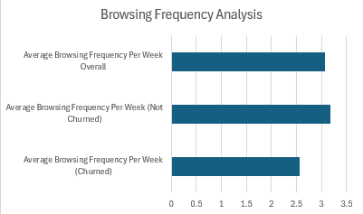

This data science project is an ecommerce customer churn project design to understand what factors cause customers to churn using machine learning. This can help ecommerce platforms adjust their features and benefits accordingly and can also help them decide whether to expend more or less resources on support services. 

#Overview This project seeks to understand what factors cause customers to churn. The key questions that I sought to answer were whether discount usage rates, loyalty membership, and number of customer support tickets affect whether a customer churn. In addition to this, I also assessed various other variables such as time spent with the company and overall amount the customer has paid by purchasing items from the company. This data matters as it can help ecommerce companies decide what feeatures to improve and also whether they need to allocate more or less resources to existing support features.

#Process I used four different datasets for this project. The first dataset was an overview containing all the features of a customer and whether they churned or not (excluding number of customer support tickets, discount usage rate, and loyalty membership). I feature engineered various variables such as "avg_account_months" using SQL queries in order to compute the average account time in months of customers that churned against customers that haven't churned. I then followed this process individually for customer support tickets, discount usage rate, and loyalty membership. I also trained and tested a model to predict whether a customer would churn or not.

#Key findings and answers to questions Question 1 - What sort of users are churning (first-time buyers, high-value, etc)? To begin with, 5071 out of 6000 customers didn't churn. This means that there is a churn rate of approximately 15.5% which is relatively low for an ecommerce platform. I found that the customers that churn tend to have lower account times (31.016170 months on avg for not churned and 29.663079 months for churned customers). In addition to this, I found that customers that churn have a lower number of total orders placed (8.841057 orders for not churned and 7.074273 orders for churned customers). Higher return rates for churned customers (this is in line with what is expected for churned users); the findings were 0.069305 return rate for customers that didn't churn and 0.083604 return rate for customers that did churn. Customers that don't churn have a higher avg browsing frequency (3.172195 times per week vs 2.555328 for customers that churn). This data may suggest that a greater incentive to stay and interact with the company more (return rate, more orders, and browsing frequency are higher for customers that haven't churned). Question 2 - Does using more discounts correlate with less churn? There was not a visible difference between avg discount usage rates for customers that did vs didn't churn (0.283111 usage rate and 0.295679 usage rate). Questoin 3 - How likely are loyal members to churn? What does this mean about the perks this ecommerce platform gives its loyalty members? The difference is extremely minimal although churned users used discounts slightly more than customers that didn't churn according to the dataset. Next, out of 1085 loyal customers, 98 churned which is a churn rate of approximately 9% which is relatively low. This likely means that the ecommerce platform allocates strong features for loyal members therefore. Qeustion 3 - Does customer service need to be improved? Question 4 - Are customers churning because of repeated failures/shortcomings from customer support? Customers that didn't churn averaged a customer support ticket usage number of 0.810885 and churned customers averaged 1.113025 times. This can potentially signal to this ecommerce company that they may need to therefore allocate more resources towards customer support to improve in this aspect. Users that are churning are using more support tickets than those that haven't churned and they may have churned due to shortcomings from many support tickets. This is a relatively significant difference that warrants concern. As for the model, I recieved strong results with precision of 0.98 for not churned, 0.91 for churned, recall of 0.99 for not churned and 0.87 for churned, and an f1-score of 0.98 for not churned and 0.89 for churned. These suggest extremely strong predictive capabilities for the machine. Although churned results warranted slightly lower overall f1-scores, not churned results are still extremely high and churned results are also relatively high (around 0.9). The significance of this finding is that we can use models such as the one I tested and trained to predict whether customers will churn according to certain features such as how long they have been purchasing items from an ecommerce platform.

#Dashboard

#Skills demonstrated
- Cleaned up data using SQL and structured it according to what was necessary
- Data visualization using Excel
- Machine learning, testing and training models
- Feature Engineering
